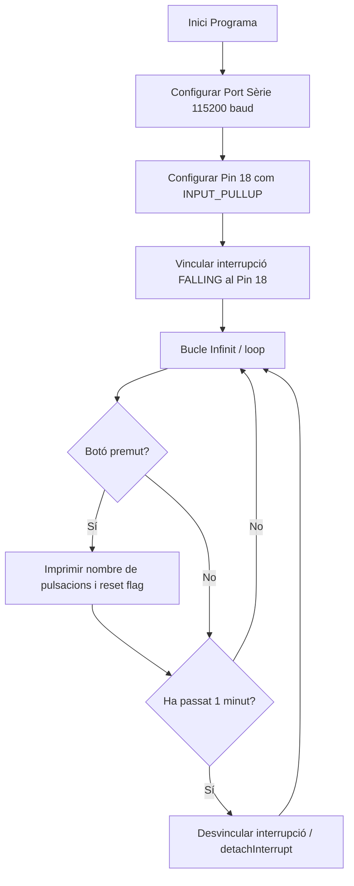
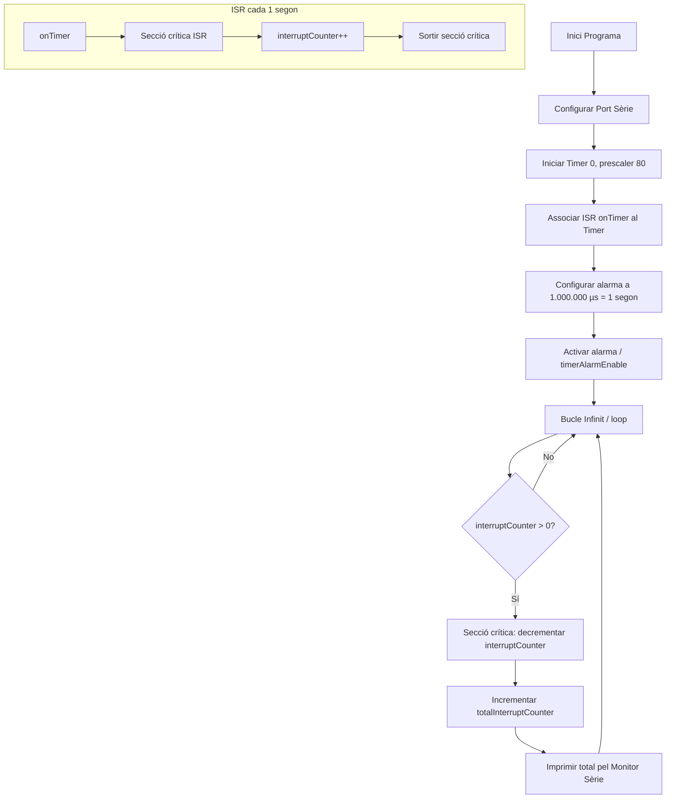
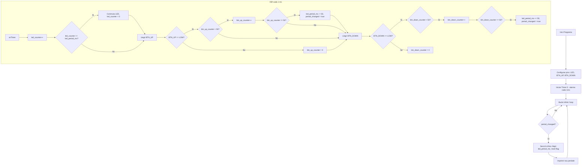

# Informe de Pràctica 2: Interrupcions

**Autors:** Julio Lázaro Alcobendas i Gerard Rodríguez González  
**Data:** 03 de Març de 2026  
**Repositori GitHub:** [https://github.com/gedrar/Practica-2](https://github.com/gedrar/Practica-2)

---

## 1. Objectius de la pràctica

L'objectiu d'aquesta pràctica és comprendre en profunditat el funcionament de les interrupcions al microcontrolador. Per posar-ho en pràctica, es dissenya un sistema per controlar l'encesa de LEDs de manera periòdica i gestionar entrades de botons físics.

L'objectiu final és que una entrada externa provoqui un canvi controlat en la freqüència d'oscil·lació del sistema.

---

## 2. Introducció teòrica

Una interrupció és un senyal especial que atura temporalment el flux normal del programa per atendre un esdeveniment prioritari i immediat. Això evita haver de revisar contínuament l'estat d'un pin (tècnica coneguda com a **Polling**) i estalvia recursos.

Hi ha principalment tres tipus d'esdeveniments que poden disparar una interrupció: els de **hardware** (per exemple, un botó que canvia de voltatge), els **esdeveniments programats** internament com els Timers, i les **crides per software**.

---

## 3. Pràctica A: Interrupció per GPIO

### Codi

```cpp
#include <Arduino.h>

struct Button {
  const uint8_t PIN;
  uint32_t numberKeyPresses;
  bool pressed;
};

Button button1 = {18, 0, false};

void IRAM_ATTR isr() {
  button1.numberKeyPresses += 1;
  button1.pressed = true;
}

void setup() {
  Serial.begin(115200);
  pinMode(button1.PIN, INPUT_PULLUP);
  attachInterrupt(button1.PIN, isr, FALLING);
}

void loop() {
  if (button1.pressed) {
    Serial.printf("Button 1 has been pressed %u times\n",
      button1.numberKeyPresses);
    button1.pressed = false;
  }

  // Detach Interrupt after 1 Minute
  static uint32_t lastMillis = 0;
  if (millis() - lastMillis > 60000) {
    lastMillis = millis();
    detachInterrupt(button1.PIN);
    Serial.println("Interrupt Detached!");
  }
}
```

### Funcionament del codi

Es configura el **pin 18** com a entrada amb resistència pull-up interna (`INPUT_PULLUP`), de manera que el pin llegeix `HIGH` en repòs i `LOW` quan es prem el botó.

S'utilitza `attachInterrupt()` en mode **FALLING**, que dispara la interrupció en el flanc de baixada (quan el voltatge passa de HIGH a LOW, és a dir, just quan es prem el botó). Cada vegada que això passa, s'executa la funció `isr()` de manera immediata i fora del flux normal del programa: incrementa el comptador `numberKeyPresses` i activa el flag `pressed`.

Al `loop()`, quan el flag `pressed` és `true`, s'imprimeix el nombre de pulsacions pel monitor sèrie i es reinicia el flag. A més, passat **1 minut** des de l'inici, el programa crida `detachInterrupt()` per desactivar la interrupció i el botó deixa de respondre.

### Sortida pel Monitor Sèrie

```text
Button 1 has been pressed 1 times
Button 1 has been pressed 2 times
Button 1 has been pressed 3 times
...
Interrupt Detached!
```

### Diagrama de flux



---

## 4. Pràctica B: Interrupció per Timer

### Codi

```cpp
#include <Arduino.h>

volatile int interruptCounter;
int totalInterruptCounter;

hw_timer_t * timer = NULL;
portMUX_TYPE timerMux = portMUX_INITIALIZER_UNLOCKED;

void IRAM_ATTR onTimer() {
  portENTER_CRITICAL_ISR(&timerMux);
  interruptCounter++;
  portEXIT_CRITICAL_ISR(&timerMux);
}

void setup() {
  Serial.begin(115200);
  timer = timerBegin(0, 80, true);
  timerAttachInterrupt(timer, &onTimer, true);
  timerAlarmWrite(timer, 1000000, true);
  timerAlarmEnable(timer);
}

void loop() {
  if (interruptCounter > 0) {
    portENTER_CRITICAL(&timerMux);
    interruptCounter--;
    portEXIT_CRITICAL(&timerMux);

    totalInterruptCounter++;
    Serial.print("An interrupt as occurred. Total number: ");
    Serial.println(totalInterruptCounter);
  }
}
```

### Funcionament del codi

El programa configura el **Timer 0** de l'ESP32 amb un prescaler de **80**, cosa que divideix la freqüència base de 80 MHz i fa que el comptador avanci a 1 MHz (1 tick per microsegon). L'alarma es configura a **1.000.000 ticks**, és a dir, es dispara cada **1 segon**.

Cada vegada que salta la interrupció, s'executa `onTimer()`. Dins de la ISR s'utilitzen `portENTER_CRITICAL_ISR` i `portEXIT_CRITICAL_ISR` per protegir la variable compartida `interruptCounter` d'accessos concurrents.

Al `loop()`, quan es detecta que `interruptCounter > 0`, s'entra en una secció crítica per decrementar-lo de forma segura, s'incrementa `totalInterruptCounter` i s'imprimeix el total acumulat d'interrupcions.

### Sortida pel Monitor Sèrie

```text
An interrupt as occurred. Total number: 1
An interrupt as occurred. Total number: 2
An interrupt as occurred. Total number: 3
An interrupt as occurred. Total number: 4
...
```

### Diagrama de flux



---

## 5. Pràctica Complementària: Control de freqüència de parpadell amb 2 botons

### Descripció de la tasca

La pràctica complementària proposa crear un programa per a Arduino ESP32 en l'entorn PlatformIO que controli un LED i dos polsadors mitjançant interrupcions d'un timer. El LED ha de parpallejar a una freqüència inicial, i cada polsador modifica aquesta freqüència: un la puja i l'altre la baixa. A més, els polsadors han de ser llegits des de la ISR del timer i s'ha d'implementar un filtre antirrebot (debounce) per hardware.

### Codi

```cpp
#include <Arduino.h>

// Definició de pins
const int LED_PIN     = 7;
const int BTN_UP_PIN  = 18;  // Polsador per augmentar freqüència (parpelleig més ràpid)
const int BTN_DOWN_PIN = 4;  // Polsador per baixar freqüència (parpelleig més lent)

// Variables del Timer
hw_timer_t * timer = NULL;
portMUX_TYPE timerMux = portMUX_INITIALIZER_UNLOCKED;

// Variables de control del LED (volatile perquè s'usen a la interrupció)
volatile int  led_period_ms = 500;  // Estat inicial: 500ms encès, 500ms apagat
volatile int  led_counter   = 0;
volatile bool led_state     = false;

// Variables per al filtre antirrebot (Debounce)
const int DEBOUNCE_TIME       = 50;  // El botó ha d'estar premut 50ms seguits per ser vàlid
volatile int btn_up_counter   = 0;
volatile int btn_down_counter = 0;

// Bandera per avisar al loop() que cal imprimir informació
volatile bool period_changed = false;

// ISR del Timer (s'executa cada 1 ms)
void IRAM_ATTR onTimer() {
  portENTER_CRITICAL_ISR(&timerMux);

  // -- 1. CONTROL DEL LED --
  led_counter++;
  if (led_counter >= led_period_ms) {
    led_state = !led_state;
    digitalWrite(LED_PIN, led_state);
    led_counter = 0;
  }

  // -- 2. LECTURA I ANTIRREBOT: Polsador UP (Més ràpid) --
  if (digitalRead(BTN_UP_PIN) == LOW) {
    if (btn_up_counter < DEBOUNCE_TIME) {
      btn_up_counter++;
      if (btn_up_counter == DEBOUNCE_TIME) {
        if (led_period_ms > 50) {       // Límit mínim
          led_period_ms -= 50;
          period_changed = true;
        }
      }
    }
  } else {
    btn_up_counter = 0;  // Es reinicia si hi ha rebots o es deixa anar
  }

  // -- 3. LECTURA I ANTIRREBOT: Polsador DOWN (Més lent) --
  if (digitalRead(BTN_DOWN_PIN) == LOW) {
    if (btn_down_counter < DEBOUNCE_TIME) {
      btn_down_counter++;
      if (btn_down_counter == DEBOUNCE_TIME) {
        if (led_period_ms < 2000) {     // Límit màxim
          led_period_ms += 50;
          period_changed = true;
        }
      }
    }
  } else {
    btn_down_counter = 0;
  }

  portEXIT_CRITICAL_ISR(&timerMux);
}

void setup() {
  Serial.begin(115200);
  pinMode(LED_PIN, OUTPUT);
  pinMode(BTN_UP_PIN,   INPUT_PULLUP);
  pinMode(BTN_DOWN_PIN, INPUT_PULLUP);

  delay(2000);
  Serial.println("Iniciant control de parpelleig per Timer de 1ms...");

  // Timer 0, prescaler 80 → compta en microsegons
  timer = timerBegin(0, 80, true);
  timerAttachInterrupt(timer, &onTimer, true);
  timerAlarmWrite(timer, 1000, true);   // Alarma cada 1000 µs = 1 ms
  timerAlarmEnable(timer);
}

void loop() {
  // El loop queda lliure; només imprimeix quan hi ha canvi de període
  if (period_changed) {
    portENTER_CRITICAL(&timerMux);
    int current_period = led_period_ms;
    period_changed = false;
    portEXIT_CRITICAL(&timerMux);

    Serial.print("Freqüència modificada. Nou període (ms encès/apagat): ");
    Serial.println(current_period);
  }
}
```

### Fitxer de configuració (`platformio.ini`)

```ini
[env:esp32-s3-devkitc-1]
platform = espressif32
board    = esp32-s3-devkitc-1
framework = arduino
monitor_speed = 115200
```

### Funcionament detallat del codi

El programa es basa en un **Timer de hardware** configurat per disparar una interrupció cada **1 ms**. Tot el treball crític es fa dins de la ISR; el `loop()` principal queda pràcticament buit.

**Control del LED:**  
Cada vegada que salta la ISR, s'incrementa `led_counter`. Quan aquest comptador assoleix el valor de `led_period_ms`, el LED commuta d'estat (encès ↔ apagat) i el comptador es reinicia. El resultat és un LED que parpalleja amb un període de `led_period_ms` ms encès i `led_period_ms` ms apagat. Amb el valor inicial de 500 ms, el LED parpalleja a **1 Hz**.

**Filtre antirrebot per software dins la ISR:**  
Per evitar deteccions múltiples degudes als rebots mecànics dels polsadors, s'implementa un **debounce basat en temps** directament dins la interrupció del timer:

- Cada mil·lisegon que el pin del polsador es llegeix com a `LOW` (premut), s'incrementa el comptador corresponent (`btn_up_counter` o `btn_down_counter`).
- Quan el comptador assoleix `DEBOUNCE_TIME` (50 ms), es considera que la pulsació és vàlida i real, i s'executa l'acció (modificar `led_period_ms`).
- Si en qualsevol moment el pin torna a `HIGH` (rebot o botó alliberat), el comptador es reinicia a 0 i cal tornar a comptar des de zero.

Això garanteix que un botó només s'accepta si ha estat premut de manera continuada durant almenys 50 ms, eliminant els falsos positius per rebot.

**Canvis de freqüència:**  
- **BTN_UP (pin 18):** Redueix `led_period_ms` en 50 ms (parpelleig més ràpid). Límit mínim: 50 ms.  
- **BTN_DOWN (pin 4):** Augmenta `led_period_ms` en 50 ms (parpelleig més lent). Límit màxim: 2000 ms.

**Comunicació amb el `loop()`:**  
La ISR activa el flag `period_changed` quan es produeix un canvi. El `loop()` detecta aquest flag, entra en una secció crítica per llegir el nou valor de forma segura, i imprimeix el nou període pel monitor sèrie.

### Sortida pel Monitor Sèrie

```text
Iniciant control de parpelleig per Timer de 1ms...
Freqüència modificada. Nou període (ms encès/apagat): 450
Freqüència modificada. Nou període (ms encès/apagat): 400
Freqüència modificada. Nou període (ms encès/apagat): 450
Freqüència modificada. Nou període (ms encès/apagat): 500
Freqüència modificada. Nou període (ms encès/apagat): 550
```

### Diagrama de flux



---

## 6. Conclusions

En aquesta pràctica hem après a usar les interrupcions de l'ESP32 tant per GPIO com per Timer. L'ús d'interrupcions permet que el microcontrolador reaccioni de manera immediata als esdeveniments externs sense necessitat de fer polling, alliberant el processador per a altres tasques.

La pràctica complementària combina els dos conceptes: el timer genera una base de temps precisa d'1 ms que s'utilitza tant per controlar el parpelleig del LED com per implementar un filtre antirrebot per software, garantint una lectura fiable dels polsadors sense necessitat de components externs addicionals.
