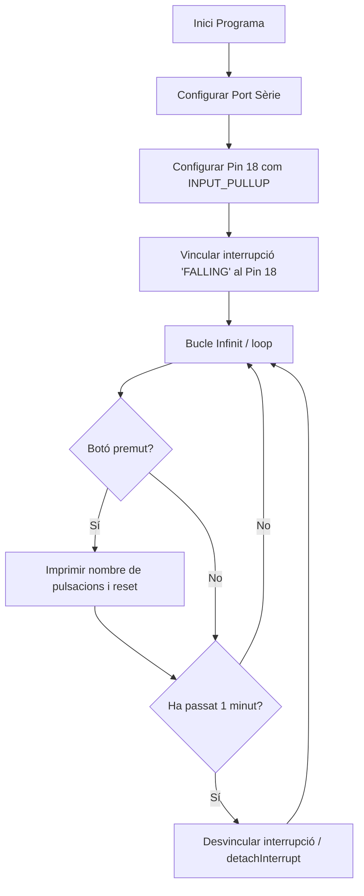

# Informe de Pràctica 2: Interrupcions
**Autors:** Julio Lázaro Alcobendas i Gerard Rodríguez González
**Data:** 03 de Març de 2026
**Repositori GitHub:** [[https://github.com/gedrar/Practica-2]](https://github.com/jla0306/Practica-2)

---

## 1. Objectius de la pràctica
L'objectiu d'aquesta pràctica és comprendre en profunditat el funcionament de les interrupcions al microcontrolador. Per posar-ho en pràctica, es dissenya un sistema per controlar l'encesa de LEDs de manera periòdica i gestionar entrades de botons físics. 
L'objectiu final és que una entrada externa provoqui un canvi controlat en la freqüència d'oscil·lació del sistema.

## 2. Introducció teòrica
Una interrupció és un senyal especial que atura temporalment el flux normal del programa per atendre un esdeveniment prioritari i immediat. Això evita haver de revisar contínuament l'estat d'un pin (tècnica coneguda com a Polling) i estalvia recursos.
Hi ha principalment tres tipus d'esdeveniments que poden disparar una interrupció :
 els de hardware (per exemple, un botó que canvia de voltatge) , els esdeveniments programats internament com els Timers, i les crides per software.

## 3. Interrupció per GPIO
```cpp
#include <Arduino.h>
struct Button {
const uint8_t PIN;
uint32_t numberKeyPresses;
bool pressed;
};
Button button1 = {18, 0, false};
void IRAM_ATTR isr() {
button1.numberKeyPresses += 1;
button1.pressed = true;
}
void setup() {
Serial.begin(115200);
pinMode(button1.PIN, INPUT_PULLUP);
attachInterrupt(button1.PIN, isr, FALLING);
}
void loop() {
if (button1.pressed) {
Serial.printf("Button 1 has been pressed %u times\n",
button1.numberKeyPresses);
button1.pressed = false;
}
//Detach Interrupt after 1 Minute
static uint32_t lastMillis = 0;
if (millis() - lastMillis > 60000) {
lastMillis = millis();
detachInterrupt(button1.PIN);
Serial.println("Interrupt Detached!");
}
}
```
## 4. Funcionament del codi
Configurem el pin 18 per detectar quan es prem un botó. S'utilitza la funció attachInterrupt en mode FALLING, que vol dir que l'interrupció es dispararà just quan el voltatge passi de HIGH a LOW. Cada vegada que això passa, s'executa la funció isr(), que incrementa ràpidament un comptador. 
Passat 1 minut el programa utilitza detachInterrupt per apagar el sensor de l'interrupció i el botó deixa de respondre.

## 5. Sortida pel Monitor Sèrie
```text
Button 1 has been pressed 1 times
Button 1 has been pressed 2 times
Button 1 has been pressed 3 times
Interrupt Detached!
```
## 6. Codi Especificacions (`platformio.ini`)
```ini
[env:esp32-s3-devkitc-1]
platform = espressif32
board = esp32-s3-devkitc-1
framework = arduino
; Configuración del monitor
monitor_speed = 115200
```
## 7. Diagrama de flux de main.cpp

